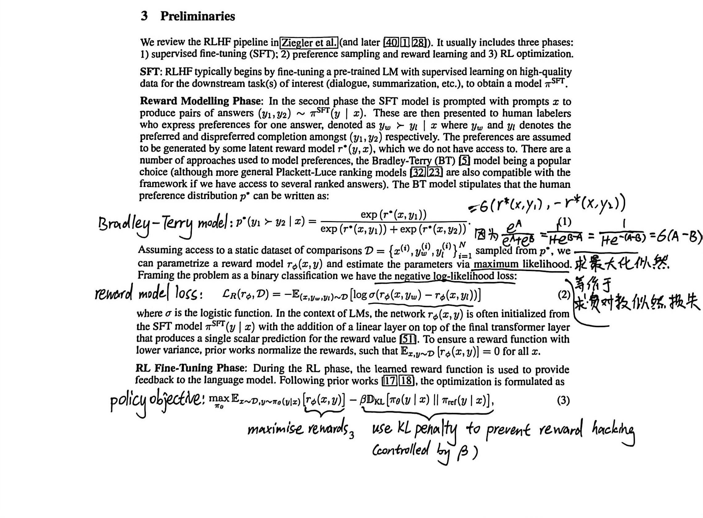
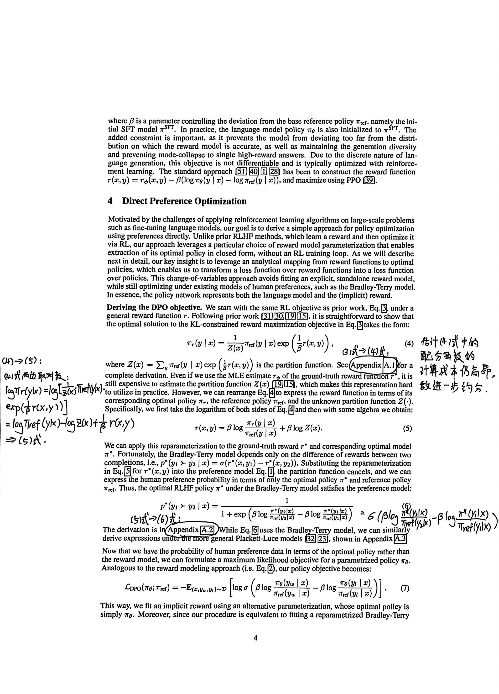
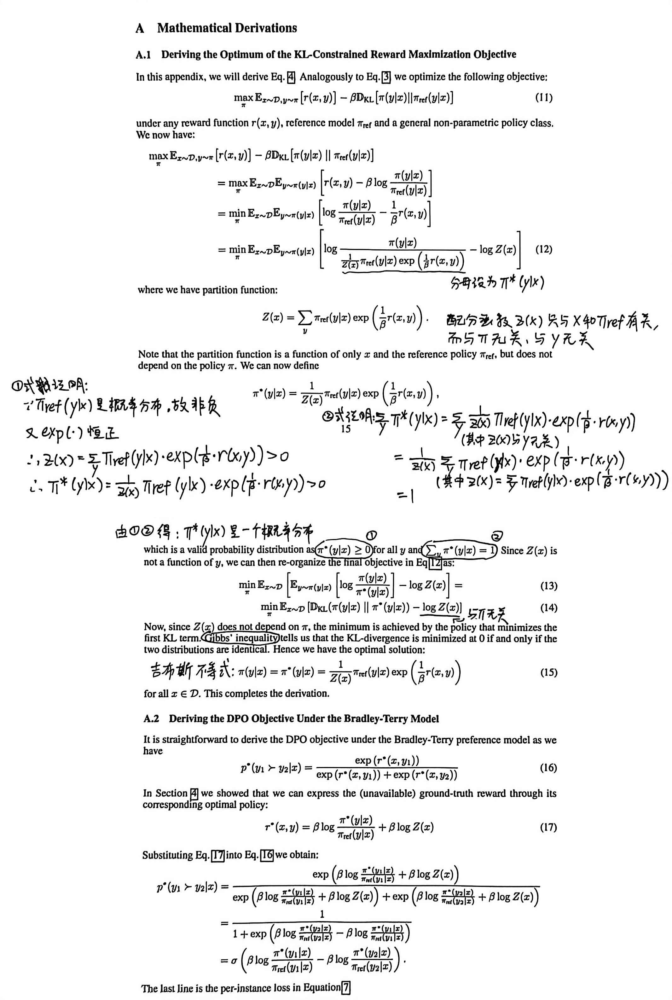

# AIXueTeacher

基于 TRL 的 DPO 算法和 PPO 变体 AIXueRLHF，后训练 AIXueTeacher 解决教学决策中的 bad case 问题。

## 环境要求

- Python 3.8+
- PyTorch 2.0+
- Transformers 4.30+
- TRL 0.7+
- DeepSpeed (可选，用于大模型训练)

## 快速开始

### 1. 数据处理
```bash
python src/dpo/format_data.py \
    --input datasets/aixue_bad_case/all_bad_cases.json \
    --output datasets/aixue_dpo_dataset \
    --format dataset
```

### 2. DPO 训练
```bash
# 8B 模型训练
bash scripts/train_dpo_8B.sh

# 32B 模型 LoRA 训练
bash scripts/train_dpo_32B_lora.sh

# 通用训练脚本
bash scripts/train_dpo.sh
```

### 3. AIXueRLHF 训练
```bash
# 8B 模型 PPO 训练
bash scripts/train_aixuerlhf_8B.sh
```

## 数据集

- `datasets/aixue_bad_case/`: 原始 bad case 数据
- `datasets/aixue_dpo_dataset/`: 处理后的 DPO 训练数据
- `datasets/aixue_rlhf_dataset/`: RLHF 训练数据

## 模块

- `modules/AIXueRLHF/`: PPO 变体训练模块，支持从状态-动作-奖励三元组学习
- `modules/aixue-rlhf-vf/`: 价值函数模块，包含多种价值函数实现

## AIXueRLHF 说明

AIXueRLHF 是一个基于 PPO 的强化学习训练框架，专门用于从人类反馈中学习。主要特点：

### 核心功能
- **PPO 变体实现**：针对教学决策场景优化的 PPO 算法
- **三元组学习**：从 `⟨prompt, response, reward⟩` 三元组中学习
- **人类反馈集成**：支持基于奖励信号的学习

### 训练参数
- `total_episodes`: 总训练轮数
- `num_ppo_epochs`: PPO 训练轮数
- `kl_coef`: KL 散度系数，控制策略更新幅度
- `temperature`: 生成温度，控制输出随机性
- `missing_eos_penalty`: 缺失结束符惩罚

### 数据格式
训练数据需要包含：
```json
{
  "prompt": "教学指令...",
  "response": "模型回复...",
  "reward": 1.0
}
```

## 附录

### DPO 公式推导

 
 
 
